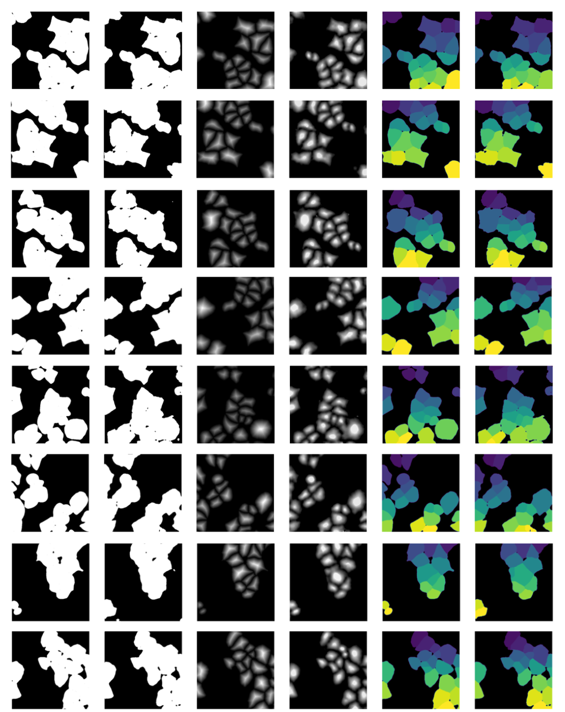

# Transformer-based method for in silico labeling to enable cell and nucleus segmentation by Marcel Kessler
### Cell and Nucleus Segmentation with In Silico Labeling using U-Net MaxViT:



## Prerequisites :wrench:
1. **The libraries used in this project can be installed with:**
   ```bash
   pip install -r requirements.txt
   ```
   and
   ```bash
   pip install -r requirements_torch.txt
   ```
2. Each of the folders: DAPI, CellMask, NucleusSegmentation and CellSegmentation contain:
   - train.py (to train a model)
   - validate.py (to validate and plot some trained model results)
   - config.yaml (to set hyperparameters like path to dataset, learning rate, ...)
3. The data_set folder is expected in the root folder of this project. It should include a tiff folder containing the dataset and a data_set_split folder
```
  isl/ 
  ├── .github/ 
  ├── data_set/
    └── tiff/ 
    └── data_set_split/
      └── split_dapi
        └── test.txt
        └── train.txt
        └── val.txt
```
- **.tiff/**: contains the .tiff and .png images of the training data
- **data_set_split/**: contain the different .txt files with the splitted data probes


## Architecture References :bookmark:

1. T. Bonte et al. “Learning with minimal effort: leveraging in silico labeling
 for cell and nucleus segmentation”. In: European Conference on Computer
 Vision. Springer. 2022, pp. 423–436. [https://arxiv.org/pdf/2301.03914](https://arxiv.org/pdf/2301.03914)

2. A. Rehman and A. Khan. “MaxViT-UNet: Multi-axis attention for medical
 image segmentation”. In: arXiv preprint arXiv:2305.08396 (2023). [https://arxiv.org/pdf/2305.08396](https://arxiv.org/pdf/2305.08396)
